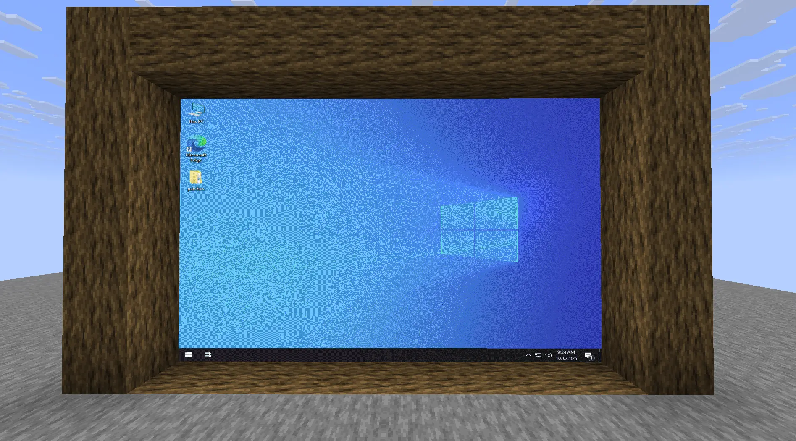

# MapVNC - Your VNC Client, inside Minecraft


English | [简体中文](README_CN.md)

MapVNC is a powerful Spigot/Paper plugin that brings a fully interactive VNC client directly into the game world. Using the robust MapEngine API, it renders a remote desktop onto a dynamic grid of in-game maps, allowing players to view and control a remote computer from within Minecraft.

Whether for server administration, remote monitoring, or just for fun, MapVNC provides a seamless and unique integration between Minecraft and any VNC-enabled machine.


## Features

- **Dynamic Display Creation**: Create VNC screens of any size, anywhere in the world.
- **Real-Time Rendering**: View a remote desktop with configurable color depth for performance tuning.
- **Full Interactivity**:
    - **Mouse Control**: Point and click on the maps to control the remote cursor.
    - **Mouse Dragging**: A sneak-based system to simulate clicking and dragging.
    - **Text Input**: Type text directly into the remote session via commands.
    - **Key Presses**: Send special key events like Enter, Shift, and Escape.
- **In-Game Management**: Easily move, resize, and remove VNC displays without restarting.
- **Proximity-Based Rendering**: Displays are only rendered for nearby players to ensure optimal server performance.
- **Quick Target Selector**: Use `-1` as an ID to automatically target the nearest screen.
- **Detailed Permission System**: Fine-grained control over who can create, manage, and interact with displays.
- **User-Friendly Commands**: Intuitive commands with rich tab-completion to guide users.

## Prerequisites

- **Server Software**: Paper, Spigot, or a compatible fork (1.21+ recommended).
- **Java**: Java 21 or higher.
- **Dependency**: **[MapEngine 1.18.10+](https://modrinth.com/plugin/mapengine)** is a **required** dependency. MapVNC will not start without it.

## Installation

1.  Ensure you have **MapEngine 1.8.10+** installed on your server.
2.  Download the latest `MapVNC-*-all.jar` file from the [Releases page](https://github.com/Steve3184/MapVNC/releases).
3.  Place the downloaded JAR file into your server's `plugins` directory.
4.  Restart or reload your server.

## Commands & Usage

The main command is `/mapvnc`, which can be shortened to `/mvnc`.

---

### Targeting the Nearest Screen

For convenience, you don't always need to know a display's specific ID. For any command that requires an `<id>`, you can use **`-1`** as a special placeholder.

When you use `-1`, the plugin will automatically find and target the nearest VNC display within a **16-block radius** of your location. The distance is measured from the display's anchor point (its top-left corner).

**Example:** Stand near a screen and type `/mvnc connect -1` to connect it, without ever needing to run `/mvnc list`.

This feature works for: `remove`, `set`, `connect`, `disconnect`, `input`, and `key`.

---

### Command List

| Command                                            | Description                                          | Permission                |
| -------------------------------------------------- | ---------------------------------------------------- | ------------------------- |
| `/mvnc create <x> <y> <z> <width> <height>`        | Creates a new VNC display at the specified coordinates. | `mapvnc.command.create`   |
| `/mvnc remove <id>`                                | Removes the VNC display with the given ID.           | `mapvnc.command.remove`   |
| `/mvnc list`                                       | Lists all active VNC displays.                       | `mapvnc.command.list`     |
| `/mvnc set <id> address <ip> <port>`               | Sets the VNC server address for a display.           | `mapvnc.command.set`      |
| `/mvnc set <id> password [password]`               | Sets or clears the password for a display.           | `mapvnc.command.set`      |
| `/mvnc set <id> colordepth <8\|16\|24>`             | Sets the connection quality (bits per pixel).        | `mapvnc.command.set`      |
| `/mvnc set <id> pos <x> <y> <z>`                   | Moves a display to a new location.                   | `mapvnc.command.set`      |
| `/mvnc set <id> size <width> <height>`             | Resizes a display.                                   | `mapvnc.command.set`      |
| `/mvnc connect <id>`                               | Connects the display to its configured VNC server.   | `mapvnc.command.connect`  |
| `/mvnc disconnect <id>`                            | Disconnects the display from the VNC server.         | `mapvnc.command.disconnect`|
| `/mvnc input <id> <text...>`                       | Types the given text into the connected display.     | `mapvnc.command.input`    |
| `/mvnc key <id> <keyName>`                         | Sends a single key press (e.g., `ENTER`, `SHIFT`).   | `mapvnc.command.key`      |

---

### Mouse Dragging

You can simulate clicking and dragging (e.g., to select text or move a window) with a special sneak-based mechanic:

1.  **Aim** at the spot on the map where you want to start the drag.
2.  **Hold down your Sneak key** (L-SHIFT by default).
3.  While still sneaking, **Left-Click** on the map. A "Mouse Down" event is sent, and an ActionBar message will appear confirming you are in dragging mode.
4.  To move the mouse while dragging, simply **click on other parts of the map**. You must remain in sneak mode.
5.  When you are finished, **Release the Sneak key**. This sends the "Mouse Up" event, completing the drag operation.

---

## Permissions

| Permission Node           | Description                                                        | Default |
| ------------------------- | ------------------------------------------------------------------ | ------- |
| `mapvnc.*`                | Grants access to all MapVNC features and commands.                 | OP      |
| `mapvnc.command.*`        | Grants access to all MapVNC subcommands.                           | OP      |
| `mapvnc.command.base`     | Allows using MapVNC's main command.                                | OP      |
| `mapvnc.command.create`   | Allows creating new VNC displays.                                  | OP      |
| `mapvnc.command.remove`   | Allows removing VNC displays.                                      | OP      |
| `mapvnc.command.list`     | Allows listing active VNC displays.                                | OP      |
| `mapvnc.command.set`      | Allows modifying display properties (address, size, etc.).         | OP      |
| `mapvnc.command.connect`  | Allows connecting a display to a VNC server.                       | OP      |
| `mapvnc.command.disconnect`| Allows disconnecting a display.                                    | OP      |
| `mapvnc.command.input`    | Allows typing text into a display.                                 | OP      |
| `mapvnc.command.key`      | Allows sending key presses to a display.                           | OP      |

## Building from Source

To compile the plugin yourself, you'll need Git and JDK 21+.

1.  Clone the repository:
    ```bash
    git clone https://github.com/Steve3184/MapVNC.git
    ```
2.  Navigate to the project directory:
    ```bash
    cd MapVNC
    ```
3.  Run the Gradle `shadowJar` task to build the plugin and include its dependencies:
    ```bash
    ./gradlew shadowJar
    ```
4.  The compiled JAR file will be located in `build/libs/`.

## License

This project is licensed under the MIT License. See the [LICENSE](LICENSE) file for details.

## Acknowledgments

-   **[MapEngine](https://github.com/FroglightNET/MapEngine)**: For the incredible API that makes the in-game rendering possible.
-   **[Vernacular](https://github.com/shinyhut/vernacular)**: For the lightweight and easy-to-use Java VNC client library.